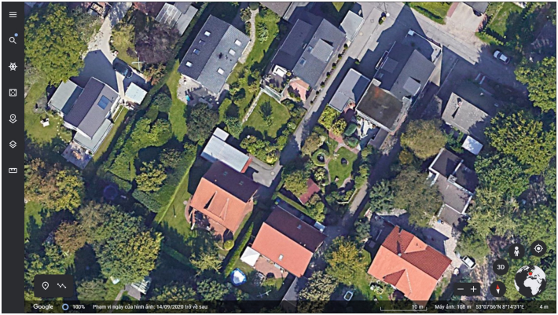
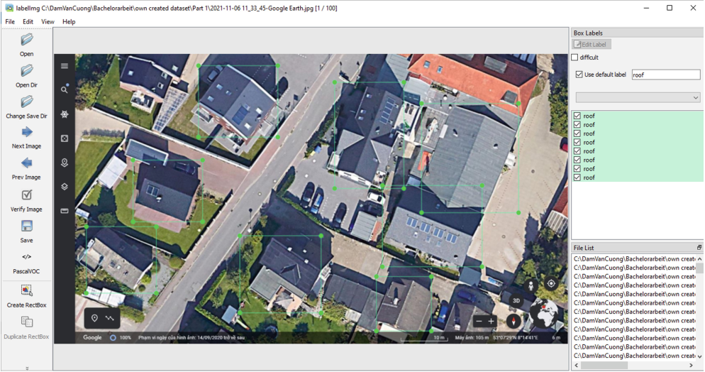
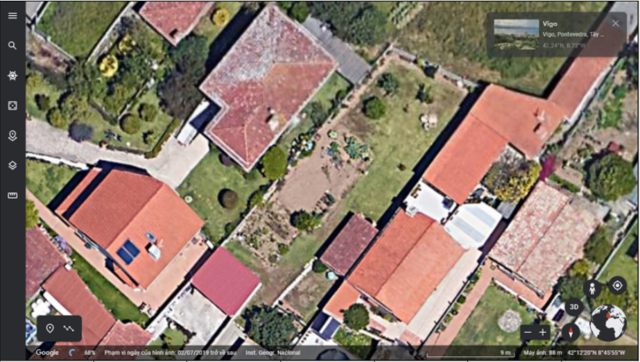
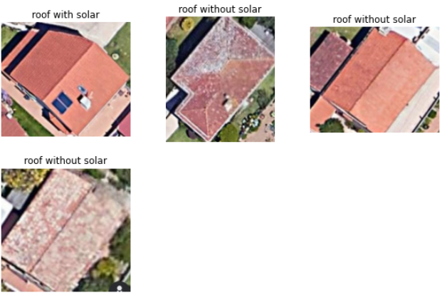
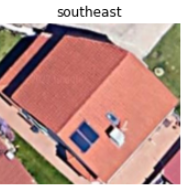
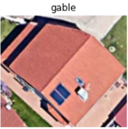
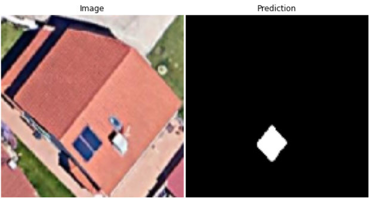

# DeepLearningSolarEnergy
This project is the final test for my paper "Deep Learning for Detecting Tilt Angle and Orientation of Photovoltaic Panels on Satellite Imagery" published in 42nd SGAI International Conference on Artificial Intelligence, AI 2022, Cambridge, UK, December 13–15, 2022.   

Please view my paper:   
## Dataset Gathering and Labeling

Since it was difficult to find a suitable rooftop dataset, we had to create our own, which, although not large, was proven to be sufficient to confirm the capabilities of our method. 
our data set consists of 430 images generated through Google Maps from 6 different cites in 5 countries in Europe: Oldenburg (Germany), Wilhelmshaven (Germany), Liverpool (England), Bordeaux (France), Milan (Italy), and Vigo (Spain). These images
are captured from a height of around 10 m above ground level. We also used the free open-source tool “LabelImg”to accelerate the labeling of images. The dataset and labeled images look like below:

## Results
(Please refer to ultimate test.ipynb or the paper for final results of the project for more detailed)

##### Given an input image like below

##### Fisrt step to detect the rooftops (using YOLOv4) in the image and subsequently classify whether the rooftop is equipped with solar pannels

##### The next step is to classify the direction of the rooftops with solar pannels

##### We classify the tilt angle of the solar cells of roof based on its type. Like the following the rooftop is gable type, which means the angle is in the range of (22.5°, 45°)

##### The final task is to detect the area od the solar cells. We bassically segemented the image that give us the solar pannels area as in white pixels. Based on the segmented area we can calculate the white pxels and therefore the real area. In this case we obtained 0.00011137690535388095 m^2 

